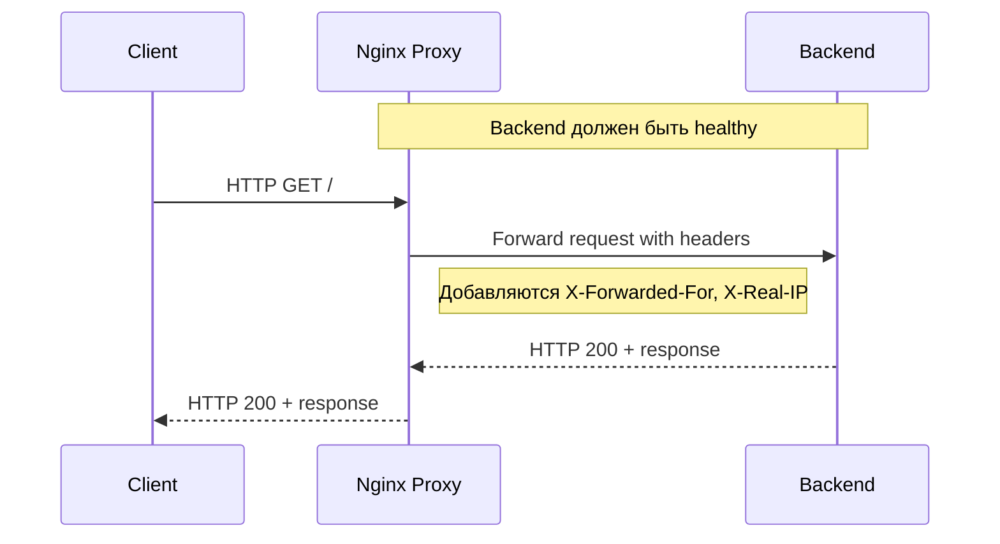

# effective-mobile-test-task

Решение DevOps тестового задания для Effective-Mobile. Развёртывание приложения и Nginx в качестве reverse-proxy в Docker-контейнерах с помощью Docker Compose.

---

# План реализации

- разработка backend + запуск в контейнере  
- запуск nginx в контейнере, проверка проксирования  
- составление docker-compose.yml  
- Readme  
- (опционально) развернуть через vagrant + ansible, для имитации деплоя на удалённый сервер  

---

# Описание backend

- Сервер на Python с endpoint `/`, который отвечает на запросы  
- Порт для сервера берётся из переменной `APP_PORT` в `.env`. Если переменная отсутствует, выводится ошибка о необходимости её задания  
- Пример файла `.env` — `.env.example`  
- Используются сторонние модули с указанием версий в `requirements.txt`  
- Dockerfile:
    - multi-stage сборка  
    - оптимизация образа для уменьшения размера  
    - healthcheck через `nc` для использования в docker-compose  
    - запуск от non-root пользователя  
    - детальные комментарии к шагам сборки внутри Dockerfile
- логгирование заголовков из nginx в stdout

---

# Описание proxy

- Наружный порт для nginx задаётся через переменную `PROXY_LISTEN_PORT` в `.env`  
- Используется template-конфигурация для подстановки переменных из `.env`  
- Передача заголовков `X-Forwarded-For`, `X-Real-IP` в backend; заголовки логгируются в stdout backend  
- Использование upstream для балансировки на возможные группы backend сервисов  

---

# Описание docker-compose

- Проброшен наружу только порт nginx  
- Backend доступен внутри Docker-сети, порт проксируется через nginx  
- Все настройки и порты управляются через `.env`  

# Инструкция запуска

## Подготовка

1. Создать файл `.env` на основе примера:

    `cp .env.example .env` или `make prepare`

2. Заполнить необходимые переменные в `.env`:

    - APP_PORT=8080 # порт backend сервера, произвольный
    - PROXY_LISTEN_PORT=80 # порт, который слушает nginx, произвольный
    - APP_HAS_DELAY=true  # опционально: искусственная задержка запуска backend

---

## Запуск отдельного backend

- Построить образ backend:

    `make build_backend`

- Запустить контейнер backend отдельно:

    `make run_backend_alone`

- Проверка работы backend:

    `curl http://localhost:$APP_PORT/`

- Просмотр логов backend:

    `docker logs backend`

---

## Запуск всего стека через Docker Compose

- Запуск с пересборкой образов:

    `docker-compose up --build`

    или через Makefile:

    `make run_compose`

- Особенности запуска через compose:
  - Build выполняется только для изменённой части кода backend, поэтому сборка быстрая  
  - Nginx proxy ждёт, пока backend станет healthy, перед проксированием запросов  

- Проверка проксирования через nginx:

    `curl  http://localhost`

- Просмотр логов контейнеров:

    `docker logs backend`
    `docker logs proxy`

---

# Диаграмма маршрута запроса

